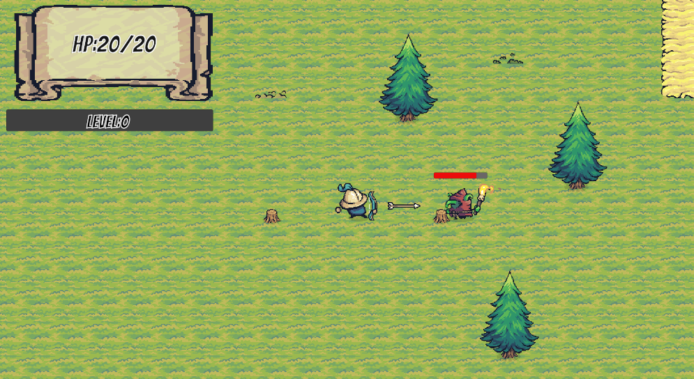
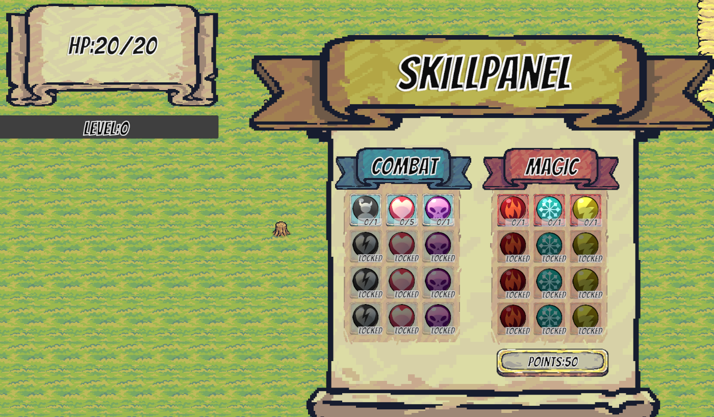
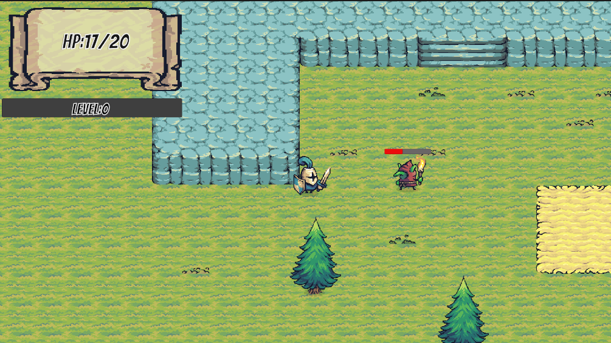

# Emberbound（烬之缚）

一个使用 **Unity 2022.3 LTS + C#** 开发的 2D 俯视角动作 RPG 原型：近战/弓双武器切换、带击退的手感反馈、状态机驱动的敌人 AI、经验升级与技能树，以及 Tilemap 高度遮挡与 Cinemachine 运镜。

> 🎮 **在线试玩**：https://hedongdong2512.github.io/Emberbound/ （WebGL 版，点开即玩）

## 游戏截图

| 远程攻击（弓） | 技能树面板 | 近战战斗 |
|:---:|:---:|:---:|
|  |  |  |

## 操作方式

| 按键 | 功能 |
|:---:|---|
| **W A S D** / 方向键 | 移动 |
| **J** | 近战攻击（剑） |
| **H** | 远程攻击（弓） |
| **Q** | 切换武器（剑 ↔ 弓） |
| **1** | 打开/关闭属性面板（可升级属性） |
| **2** | 打开/关闭技能树 |

## 已实现功能

**战斗与手感**
- 近战/远程（弓箭）双武器系统，按键即时切换
- 命中击退（Knockback）：玩家与敌人互有击退反馈，攻击带命中判定与动画
- 血条 UI、敌人死亡经验掉落

**敌人 AI（有限状态机 FSM）**
- 状态流转：巡逻/待机 → 玩家检测（范围圆判定）→ 追击 → 攻击 → 受击硬直
- 攻击带前摇动画与伤害判定，被击退后恢复追击

**成长系统**
- 经验/等级系统：击杀获取经验，指数成长曲线，升级获得技能点
- 技能树 UI：24 个技能槽位，含前置解锁链与升级消耗技能点逻辑
- 属性面板：生命/攻击等属性成长，实时刷新 HP UI

**场景与表现**
- Tilemap 高度系统：通过入口/出口脚本实现高低地形遮挡与穿越（桥梁/悬崖）
- Cinemachine 摄像机跟随
- TextMeshPro 数值与状态 UI

## 技术架构

```
Assets/Scripts/
├── CameraFollow.cs       # 手写平滑跟随相机（主方案为 Cinemachine，此实现保留备用）
├── PlayerScripts/        # 玩家侧
│   ├── PlayerMovement    # 移动/翻转/攻击输入
│   ├── Player_Combat     # 近战攻击判定与伤害
│   ├── Player_Bow/Arrow  # 弓箭发射与箭矢飞行
│   ├── Player_ChangeEquipment  # 武器切换
│   ├── PlayerHealth / StatsManager / StatsUI  # 生命与属性
│   └── ExpManager        # 经验/等级（事件驱动 OnLevelUp）
├── SkillTree/            # 技能树
│   ├── SkillSo           # ScriptableObject 技能数据
│   ├── SkillSlot         # 槽位升级/前置解锁
│   ├── SkillTreeManager  # 技能点管理与连锁解锁
│   ├── SkillManager      # 技能效果分发
│   └── ToggleSkillTree   # 技能树开关（按键 2，控制 Time.timeScale 暂停）
├── Enemy_*.cs            # 敌人状态机 AI（移动/战斗/血量/受击）
└── Tilemap Scripts/      # Elevation_Entry/Exit 高度遮挡
```

关键设计：
- **事件解耦**：`OnLevelUp`、`OnMonsterDefeated` 等用 C# 事件广播，模块间不互相引用（击杀 → 经验 → 升级 → 技能点全链路事件驱动）
- **数据驱动**：技能用 ScriptableObject（`SkillSo`）配置，Inspector 可视化编辑
- **状态机 AI**：敌人行为以状态切换组织，扩展新敌人只需调整参数与状态

## 运行方式

1. 安装 [Unity 2022.3.62f3](https://unity.com/releases/editor/whats-new/2022.3.62)（LTS）
2. 克隆仓库：`git clone https://github.com/hedongdong2512/Emberbound.git`
3. 用 Unity Hub 打开项目，首次导入编译后，打开 `Assets/Scenes/RPG.unity`，点击 ▶ 运行

## Roadmap

- [ ] 技能树内容扩充（更多主动/被动技能与数值）
- [ ] 多种敌人类型与 Boss 战
- [ ] 背包与物品掉落系统
- [ ] 任务系统与存档（JSON/二进制序列化）
- [x] WebGL 在线试玩版本（见顶部链接）

## 环境

- Unity 2022.3.62f3 LTS · C# · Cinemachine · TextMeshPro · Unity 2D Tilemap
